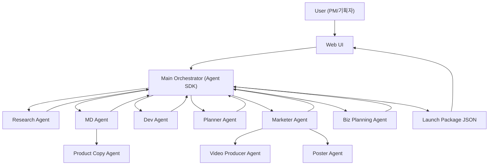
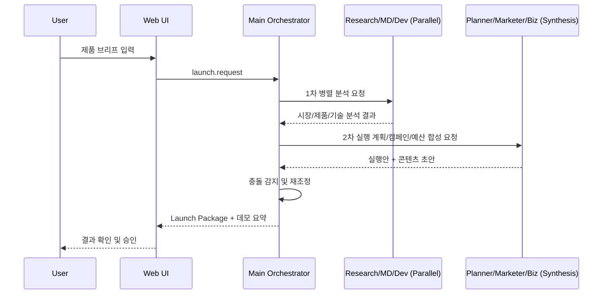

# AI Launch Studio PRD

## 1. 제품 개요

### 1.1 서비스명
AI Launch Studio

### 1.2 한 줄 소개
신규 제품 출시를 위해 리서치-기획-개발-마케팅 전 과정을 멀티 에이전트로 실행하는 AI 런칭 스튜디오

### 1.3 배경
- 제품 출시 준비 과정에서 팀 간 의사결정이 느리고 산출물 형식이 제각각임
- 출시 전 필수 산출물(시장 분석, 실행 계획, 홍보 콘텐츠, 데모 스토리)을 짧은 시간에 맞추기 어려움
- 공모전 제출 요건(작동 프로덕트, 소개+시연 영상, OpenAI API 활용)을 한 흐름으로 보여줄 필요가 있음

## 2. 목표 / 비목표

### 2.1 목표
- 메인 오케스트레이터 기반으로 에이전트 협업 파이프라인 구현
- 제품 브리프 입력 후 실행 가능한 런칭 패키지 자동 생성
- 공모전 제출 요건 3개를 시연 가능한 상태로 완성

### 2.2 비목표
- 완전 자동 배포 파이프라인(이번 범위 제외)
- 실제 광고 매체 집행(이번 범위 제외)

## 3. 사용자
- PM/기획자: 제품 브리프 입력, 최종 의사결정 승인
- 마케팅 리드: 영상/포스터/카피 산출물 검토
- 개발 리드: 기능 구현 가능성 및 일정 리스크 검토

## 4. 핵심 가치 제안
- 병렬 에이전트 분석으로 출시 준비 시간을 단축
- 팀 역할별 책임 경계를 명확히 유지하면서 충돌 조정 자동화
- 출시 전략 문서와 콘텐츠 초안을 동시에 생성

## 5. 에이전트 구성

### 5.1 메인 오케스트레이터
- 입력: 제품 브리프(타깃, 가격, 예산, 일정, KPI)
- 처리: 에이전트 작업 분배, 충돌 조정, 최종 패키지 합성
- 출력: Launch Package JSON + 사용자용 요약 보고서

### 5.2 코어 에이전트
- Research Agent: 시장/경쟁/트렌드 조사
- MD Agent: 제품 포지셔닝, 상품 전략, 핵심 USP
- Planner Agent: 일정, 마일스톤, 실행 체크리스트
- Marketer Agent: GTM 메시지, 채널 전략, 캠페인 설계
- Dev Agent: 구현 범위/기술 리스크/데모 실현성 검토
- Biz Planning Agent: 예산, 매출 가설, KPI/ROI 설계

### 5.3 서브 에이전트
- Video Producer Agent (Marketer 산하): 홍보영상 콘셉트, 씬 구성, 나레이션 초안
- Poster Agent (Marketer 산하): 포스터 카피/레이아웃 가이드
- Product Copy Agent (MD 산하): 상품 설명문 작성, 마케터 톤 가이드 반영

## 6. 기능 요구사항

### FR-1 브리프 입력
- 사용자는 제품명, 타깃 고객, 가격대, 예산, 일정, 목표 KPI를 입력할 수 있어야 함

### FR-2 멀티 에이전트 오케스트레이션
- 오케스트레이터는 1차 병렬 분석(Research/MD/Dev)을 수행해야 함
- 2차 합성 단계(Planner/Marketer/Biz Planning)를 수행해야 함
- 충돌 항목(예산, 일정, 메시지)을 감지하고 재조정 요청을 수행해야 함

### FR-3 콘텐츠 산출물 생성
- 영상 시나리오, 포스터 기획, 상품설명 초안을 생성해야 함
- 산출물은 Launch Package 내 표준 스키마로 저장되어야 함

### FR-4 보고서/시연 출력
- 최종 결과를 대시보드에서 요약 카드 + 상세 JSON으로 확인 가능해야 함
- 시연 영상 스크립트용 요약 텍스트를 별도 출력해야 함

## 7. 비기능 요구사항
- 응답 지연: 단일 실행 90초 이내(목표)
- 재현성: 같은 브리프 입력 시 핵심 의사결정 필드 일관성 유지
- 가시성: 각 에이전트의 입력/출력/근거 로그 추적 가능

## 8. 시스템 아키텍처

## 9. 산출물 스키마 (요약)
- `research_summary`
- `product_strategy`
- `launch_plan`
- `marketing_assets.video_script`
- `marketing_assets.poster_brief`
- `marketing_assets.product_copy`
- `budget_and_kpi`
- `risks_and_mitigations`

## 10. 성공 지표
- 출시 패키지 생성 시간 15분 -> 3분 이하 단축
- 데모 시나리오 완주율 100%
- 공모전 요건 충족률 100%

## 11. 공모전 요건 매핑
1. 실제 작동 프로덕트: 웹 UI + 오케스트레이터 + 멀티 에이전트 실행
2. 서비스 소개 + 작동 시연영상: 자동 생성된 요약/씬 구성으로 제출물 제작
3. OpenAI API 1개 이상: OpenAI Agent SDK 기반 멀티 에이전트 orchestration

