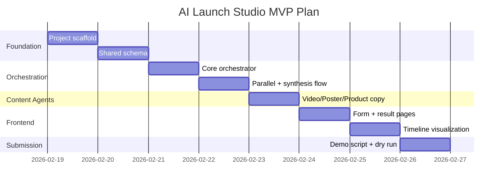
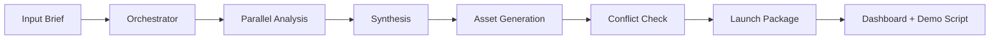

# AI Launch Studio Implementation Plan

## 1. 구현 전략
- 목표: 공모전 데모 중심 MVP를 빠르게 완성
- 원칙: 작동 우선, 추적 가능성 우선, 제출물 직결 산출물 우선
- 기술 방향: OpenAI Agent SDK + FastAPI + React

## 2. 범위 정의

### In Scope (MVP)
- 메인 오케스트레이터 1개 + 코어 에이전트 6개 + 서브 에이전트 3개
- 브리프 입력 -> 병렬 분석 -> 합성 -> 최종 패키지 출력 파이프라인
- 결과 대시보드 및 데모 요약 화면

### Out of Scope (MVP 이후)
- 외부 광고 집행 API 연동
- 장기 사용자 계정/권한 고도화
- 자동 배포 완전 자동화

## 3. 목표 폴더 구조

```text
ai-launch-studio/
  backend/
    app/
      agents/
        orchestrator.py
        research_agent.py
        md_agent.py
        planner_agent.py
        marketer_agent.py
        dev_agent.py
        biz_planning_agent.py
        video_producer_agent.py
        poster_agent.py
        product_copy_agent.py
      schemas/
        launch_package.py
      routers/
        launch.py
      services/
        agent_runtime.py
      main.py
    requirements.txt
  frontend/
    src/
      pages/
        Dashboard.tsx
        LaunchForm.tsx
        LaunchResult.tsx
      components/
        AgentTimeline.tsx
        AssetPreview.tsx
      api/
        client.ts
  PRD.md
  implementation_plan.md
```

## 4. 실행 단계

### Phase 1: 프로젝트 골격
- 백엔드/프론트엔드 초기화
- 공통 환경변수/실행 스크립트 정리
- Launch Package 스키마 초안 정의

### Phase 2: 오케스트레이션 코어
- Agent SDK 기반 오케스트레이터 구현
- Research/MD/Dev 1차 병렬 호출 구현
- Planner/Marketer/Biz Planning 2차 합성 구현

### Phase 3: 콘텐츠 에이전트
- Video Producer/Poster/Product Copy 서브 에이전트 연결
- 마케팅/MD 검수 루프(톤, 사실성) 추가
- 최종 패키지 JSON 직렬화

### Phase 4: UI 및 시연
- LaunchForm 입력 플로우 구현
- AgentTimeline으로 협업 흐름 시각화
- 결과 화면에 영상/포스터/카피 섹션 렌더링

### Phase 5: 제출물 패키징
- 서비스 소개 1p 요약 문서 정리
- 3~5분 시연 스크립트 고정
- 데모 체크리스트 완료

## 5. 일정 계획 (상대 일정)



## 6. 런타임 플로우



## 7. 검증 기준
- API: `/launch/run` 호출 시 Launch Package 필수 필드 100% 반환
- UI: 입력->결과까지 끊김 없는 단일 데모 플로우 완주
- 시연: 3회 연속 데모에서 치명 에러 0건
- 요건: 공모전 3개 필수 조건 체크리스트 완료

## 8. 리스크 및 대응
- 모델 응답 구조 불안정 -> 구조화된 출력 스키마 강제 + fallback parser
- 에이전트 간 출력 충돌 -> 오케스트레이터 재조정 라운드 1회 고정
- 데모 시간 초과 -> 자산 생성 모드(빠른 요약/상세 생성) 분리

## 9. 즉시 실행 TODO
- [ ] `backend` 초기화 및 Agent SDK 런타임 연결
- [ ] 에이전트 인터페이스(입력/출력 타입) 공통화
- [ ] `frontend` 폼/결과 페이지 뼈대 구현
- [ ] 데모 스크립트 초안 작성
- [ ] 시연 리허설 체크리스트 작성

